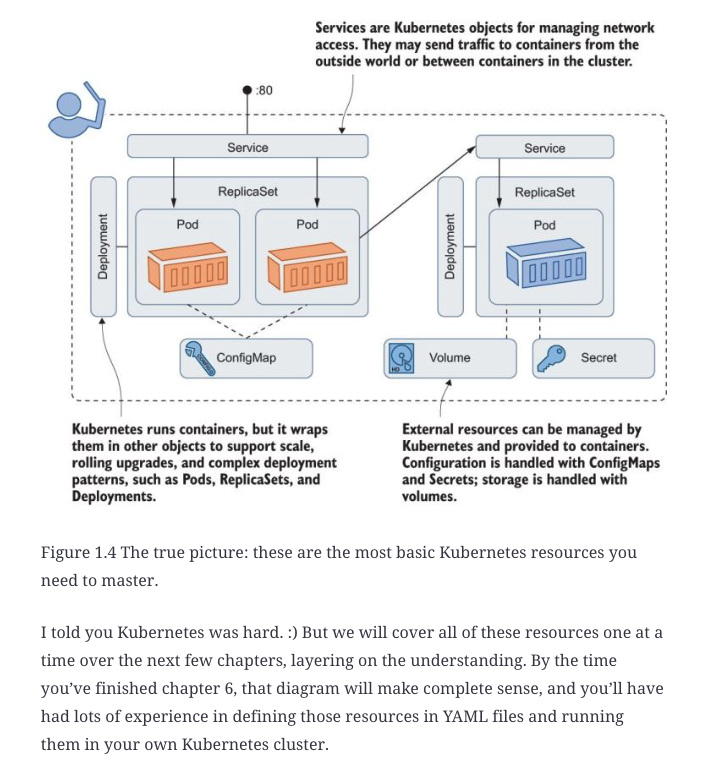
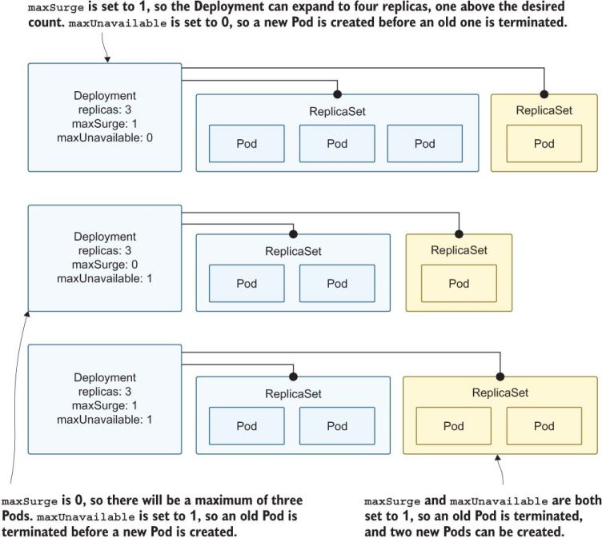
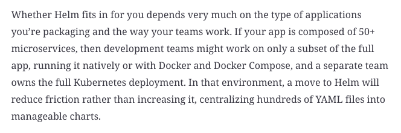
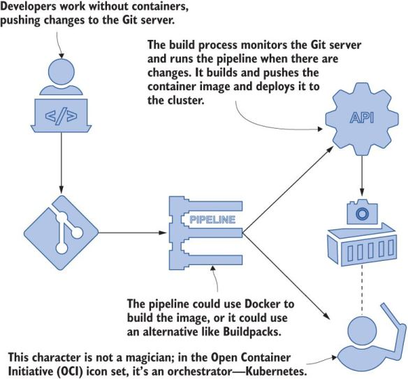
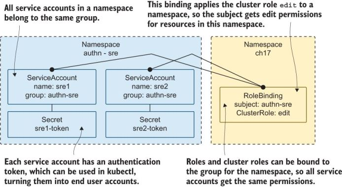

## Setup/teardown
See `book_code.md` and `cleanup.md`, respectively.

## Chapter 2
* p. 18, my output for the third command:
```bash
λ kubectl get pod hello-kiamol -o jsonpath='{.status.containerStatuses[0].containerID}'
containerd://9e3b015012a1fe9aacf96a4a88fbdc69a66aa39e9ce47935cdf1c52f9d6c2cf0
```
  * So, how do we get it to run via Docker? One day of use is showing me an AWS bill of USD 1.74; wouldn't Docker Desktop be free?

## Chapter 5
- [ ] mentions write-ahead log (WAL)... learn more!

something really clicked at some point... essentially the part where we created a PVC but no PV, so it is `Pending`. I can see how this might be working behind the scenes when we go to provision a new EC2 instance, for example.
Also how cool it is to decouple the storage from the node/app!
Imagine retaining some volumes for archival purposes, or swapping PVs to change how the app works. A test PV with demo data & then a real/prod version. Or different PVs depending on the person/org? Maybe not swapping on-the-fly, but easy to deploy an app and "plug-in" the custom/specific PV required.

Similarly:
> Now you have a custom storage class that your apps can request in a PVC.
Neat that we could build our own in-house cloud/cloud provisioning service this way...

- [ ] This seems worth looking into:
> having your whole stack defined in Kubernetes manifests is pretty tempting, and some modern database servers are designed to run in a container platform; TiDB and CockroachDB are options worth looking at.

## Chapter 6
- [X] run `kubectl get all` at end/before I cleanup; see what's all there.
      I did `kubectl get all -l kiamol=ch06-lab` as part of the lab, at least. See also results within the chapter.
- [X] ~~once I complete this chapter, revisit page 7;~~ relevant segment below:


Section 6.3: "The DaemonSet takes its name from the Linux daemon, which is usually a system process that runs constantly as a single instance in the background (the equivalent of a Windows Service in the Windows world)."

Still not fully understanding, but https://en.wikipedia.org/wiki/Kubernetes#DaemonSets helps. See also [image](https://learning.oreilly.com/api/v2/epubs/urn:orm:book:9781617297984/files/OEBPS/Images/6-18.jpg).

## Chapter 7
* "The Pod is a virtual environment that creates a shared networking and filesystem space for one or more containers."
* "...you can’t have some Linux and some Windows containers in the same Pod (yet)..." --> I wonder if you can use `wsl` in a Windows container, though.
* "Another container in the same Pod can provide a REST API, which reports on what the app container is doing."
* "...you shouldn’t be running different apps in the same Pod."
* I like the idea of an init container with `git` installed that pulls the latest code, and then other pods can run it.
* https://bit.ly/376rBcF maps to https://github.com/sixeyed/kiamol/blob/master/ch07/resources/Sune-Keller-Service-Hotel.pdf
* "Perhaps you’ve heard of the service mesh architecture, using technologies like Linkerd and Istio..." No, I haven't.

## Chapter 8
* "Kubernetes is a dynamic environment, and data-heavy apps typically expect to run in a stable environment."
  * Makes sense. In my work, we certainly have data-heavy processes... I'm excited to read to see if there are options or suggestions.
* "Figure 8.17 Yikes! And this is a simplification that doesn’t show volumes or init containers."
  * ...but it does show volumes!

## Chapter 9
* **rollout**: essentially changeset; not due to changes to Deployment, but to anything we do to Pods, whether through config file updates or imperative updates (shown in code).
* "You need to plan your selectors carefully up front, but you should add whatever labels you need to your Pod spec to make your updates manageable."
* After the `v3.1` output: "This is the hot reload approach..." (meaning deleting & re-applying?)
* "`Recreate` is the alternative to the default strategy, `RollingUpdate`."
  * Not recommended by the author.
  * `maxUnavailable` and `maxSurge` settings are intuitive; these dictate what % of pods can be unavailable or added, respectively.
  
* "Deployments are the controllers you use the most."
* Section 9.5 talks about blue/green deployments. Neat how you can just "flip a switch" to choose which version is active. Both can be running, but the active one gets the traffic.

## Chapter 10
[bookmark](https://learning.oreilly.com/library/view/learn-kubernetes-in/9781617297984/OEBPS/Text/10.htm#heading_id_3)
* see https://kiamol.net/index.yaml
* "You should consider Helm charts to be immutable and always publish changes by publishing a new package version."
* "An application package in Helm is called a *chart*; charts can be developed and deployed locally or published to a *repository*."
* "How’s this for an example: you can generate a hash from the contents of a ConfigMap template and use that as a label in a Deployment template, so every time the configuration changes, the Deployment label changes too, and upgrading your configuration triggers a Pod rollout."
* This paragraph was great:


## Chapter 11
* "This is the final chapter on Kubernetes in the real world" ?? So the rest is theoretical?
* Figure_11-4.jpg intrigues me: "Using containers in the outer loop lets developers focus on code."

* **BuildKit** - open source project from the Docker team that helps mae our app portable (build container images without Docker!)
  * "...a CNCF project called Buildpacks, a technology pioneered by Heroku to power their PaaS product."
  * Yong and I talked about this. I want to know how often Docker is not used, and why we would use BuildKit in a development/production setting.
  * Essentially, it's *if* Docker is not used, there are options.
* "Objects within a namespace are isolated, so you can deploy the same apps with the same object names in different namespaces."
* Great bullet points in 11.5, notably, "The commitment to learning Docker and Kubernetes pays off because they’re portable skills—developers can easily move between projects using a standard toolset."

## Chapter 12
* Readiness probes seem neat, especially for larger clusters & with nodes/processes that take a while to setup. Imagine an app where each node needs to read a large dataset & do some preprocessing before results are displayed. Or really any pipeline... nodes waiting for an earlier piece of the pipeline to complete will need to wait.
* "If you see a Pod in CrashLoopBackOff, it usually means the app is beyond repair."
* Bookmark: 12.4

## Chapter 13
* using Fluentd (collector) and Elasticsearch (storage) with Kubernetes logs
  * EFK stack: Elasticsearch, Fluentd, and Kibana
* Fluent Bit can modify logs... why would we want that? I could see the case for redacting sensitive info.

## Chapter 14
* Monitoring applications and Kubernetes with [Prometheus](https://prometheus.io/)
* Prometheus does seem comparable to Datadog, so if you use the latter, you don't necessarily need the former.
* cAdvisor uses Kubernetes service discovery to find every Pod in the DaemonSet, which would present one target for each node in a multinode cluster.

## Chapter 15
* Managing incoming traffic with Ingress
* showing sites like web.kiamol.local, with endpoints that potentially route to different nodes
* Traefik

## Chapter 16
* "Kubernetes has many features to secure your applications, but none of them are enabled by default."
* Rules default to deny
* APOD apps not working, but https://apod.nasa.gov/apod/image/2007/ISS063-E-39888_APOD1050.jpg from screenshot is nice.
* GitHub repository full of network policy recipes published by Ahmet Alp Balkan, an engineer at Google: https://github.com/ahmetb/ kubernetes-network-policy-recipes.
* Figure 16.7: "If you’ve heard the phrase “secure by default,” it wasn’t said about Kubernetes."
* Not totally sure I understand everything mentioned about webhooks...

## Chapter 17
* role-based access control (RBAC): says technically optional, but my assumption is it should be enabled if it isn't by default
  * n.b.: "resources need to exist before the rules can be applied"
* Kubernetes does not authenticate end users (use OIDC, AD, or LDAP); we use certificates in this chapter
* "If you're into OpenSSL and certificates..." Boy, am I!
  * I ran `openssl x509 -in user.crt  -text -noout` and saw `Issuer: CN=kubernetes` and `Subject: C=UK, ST=LONDON, L=London, O=kiamol, CN=reader@kiamol.net`
* "best practice is to create a dedicated service account for each component"
* `csr`: certificate-signing requests
* This is interesting:
> A common alternative is to misuse service accounts, creating a service account for every end user and distributing a token for authentication with kubectl. This approach doesn’t scale to hundreds of users, but it is a viable option if you don’t have an external authentication system and you want secure access to Kubernetes for a small number of users. You have to take a slightly quirky approach to groups, because you can’t create a group and add a service account to it. Instead, you need to treat namespaces as groups, create a namespace for each group you want, and put all the service accounts in that group. Figure 17.13 shows the setup.
  * illustrated example of that:

> Figure 17.13 Service accounts have tokens and groups so they can be misused as user accounts.
* links: https://jwt.io/, https://github.com/docker/for-mac/issues/4774, [Krew (plugin manager)](https://krew.sigs.k8s.io/docs/user-guide/setup/install)

## Chapter 18
* "The best way to learn about all of the Kubernetes components is to install a cluster from scratch, and that’s what you’ll do in this chapter."
* Kubernetes *control plane*: the management side of the cluster (receives `kubectl` deployment requests)
* Lots of keywords defined, like *kubelet* (background agent)

## Chapter 19
* how to direct Pods to specific nodes & schedule placement of pods w.r.t. other pods
* use taints to identify nodes that are different from the rest
* "Topology describes the physical layout of your cluster..." -- I wonder if there are tools that help visualize this. Generating something like one of the figures from this book.
* In section 19.3... ok, so if the current job is taking more resources than it needs & another pod is added... that works if the code is parallelizable, right? Just throwing resources doesn't always make a job go faster.
* *priority class* of the Pod -- an integer up to one billion!
* `kind/print-memory.sh` is a neat little script

### Chapter 19 Lab
* Didn't run it, but looked over the files. Feels like we're spoofing region, but I could see how the configuration running on a cloud service provider would then follow the desired region.

## Chapter 20
* it's very common to extend Kubernetes
* defining custom resources --> felt like defining classes
* "The [user] CRD is difficult to read because of the schema..." I don't think it's too bad. I'm used to YAML by now ;-)
* [cert-manager](https://cert-manager.io/) is "a CNEF project that adds TLS certificate management to Kubernetes"
* https://operatorhub.io/

### Section 20.5: Understanding when to extend Kubernetes
* guidelines:
  * ensure you need to (not another existing way)
  * see if a third-party operator exists
  * start simple --> focus on user experience
  * make use of development toolkits if writing in Go

## Once complete:
- [ ] read https://en.wikipedia.org/wiki/Kubernetes
- [ ] consider a certification. See page 8 for some info
- [ ] Try *Learn Docker in a Month of Lunches* (per p. xiii)
  - [ ] explore some of the docker images from this book in more detail, like [this one](https://hub.docker.com/r/kiamol/ch03-sleep)
- [ ] could revisit Section 11.5 to review the author's workflow; where does he work full-time?

